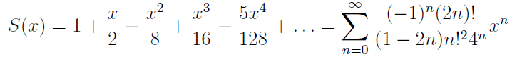

# Ряд Тейлора

Вычислить и вывести в файл в виде таблицы значения функции S(x), заданной с помощью ряда 



на интервале от `x1` до `x2` с шагом `dx` с точностью `eps`. Под точностью понимается абсолютная величина очередного слагаемого.
Вещественные числа `x1`, `x2`, `dx`, `eps` вводятся пользователем. 

Для `x > 1` или `x < -1` выводить значение `NaN`.

Отдельным столбцом вывести значение выражения `(S(x)*S(x)-1)` в тех же точках. 

Имя выходного файла задано в командной строке. 

Разделителем между столбцами является знак табуляции `\t`.

Значения во втором и третьем столбце выводить с точностью 16 знаков после запятой. 
Установить количество знаков после запятой можно с помощью метода `.precision(16)` объекта `ostream`
и манипулятора `std::fixed`. Например,
```
double x=3.14;
std::cout.precision(16);
std::cout << std::fixed << x;
```

## Пример
Для `x1`, `x2`, `dx`, `eps` имеющих значения `0`, `1.0`, `0.2`, `1e-6`, соответственно, в выходном файле:
```
0.00	1.0000000000000000	0.0000000000000000
0.20	1.0954451437499999	0.2000000629654579
0.40	1.1832157076000001	0.3999994107113689
0.60	1.2649113110139700	0.6000006247310805
0.80	1.3416411997921713	0.8000011089797769
1.00	1.4142130625439175	0.9999985862698464
```

## Требования

Программа не должна использовать контейнеры STL (std::vector, std::string и т. д.). 

Программа не должна использовать функции математической библиотеки (std::pow, std::sqrt и т. д.).
